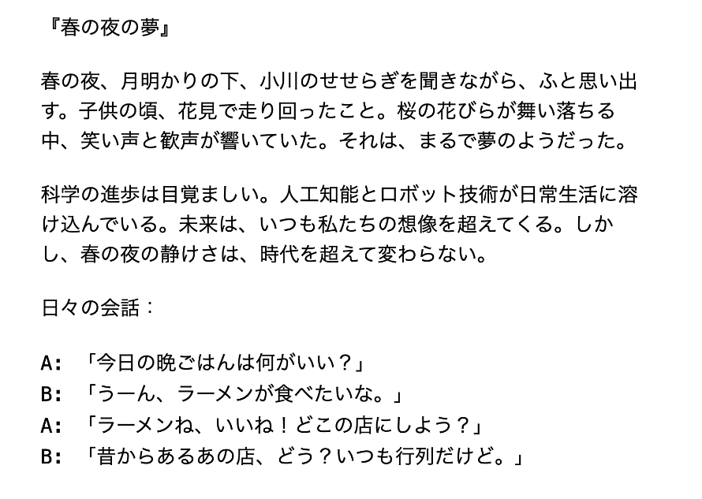
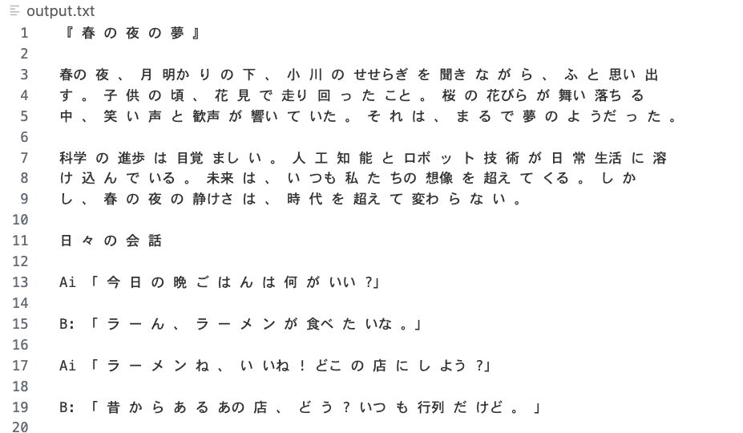

# OCR local

localでさくっと日本語OCRしたい

# venv　activate
```
python3 -m venv ocr_local
source ocr_local/bin/activate
```

# install 
```
brew install tesseract
pip install -r requirements.txt
```

# install tessdata
* [jpn.traineddata](https://github.com/tesseract-ocr/tessdata_best/blob/main/jpn.traineddata)
* [jpn_vert.traineddata](https://github.com/tesseract-ocr/tessdata_best/blob/main/jpn_vert.traineddata)

```
mv ~/Downloads/jpn.traineddata /opt/homebrew/Cellar/tesseract/5.3.3/share/tessdata/jpn.traineddata
mv ~/Downloads/jpn_vert.traineddata /opt/homebrew/Cellar/tesseract/5.3.3/share/tessdata/jpn_vert.traineddata
```

# 実行
```
bash ocr.sh ./sample/sample.pdf
```

# 結果
input


output

